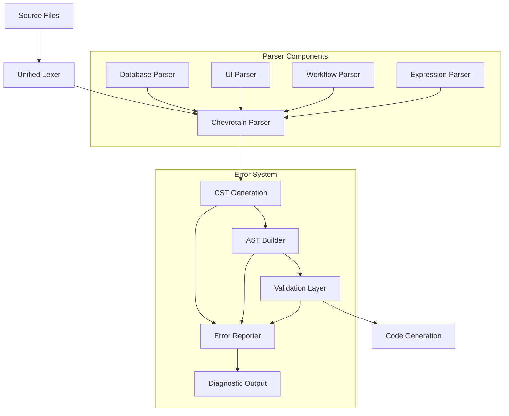
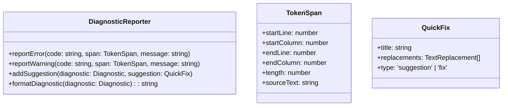
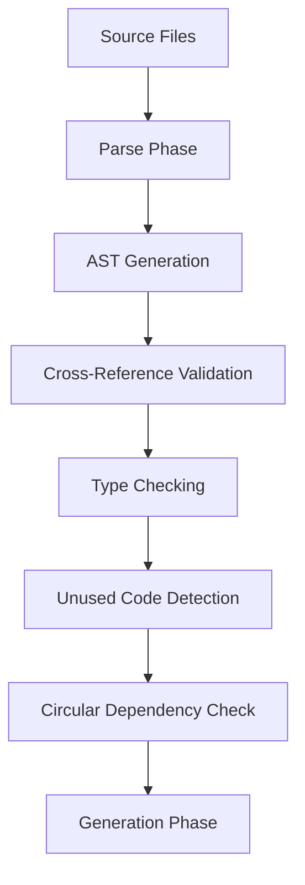

# Core Language & Parser Production Implementation Design

## Overview

This design document outlines the implementation of P0 (Critical) and P1 (Important) priority items from the core language parser gaps checklist to create a production-ready language specification with unified architecture, comprehensive type system, and robust error handling.

## Architecture

### Current State Analysis

The Locus parser architecture currently employs a hybrid approach:
- **Chevrotain-based parsing** for database entities, design systems, pages, components, and stores
- **Custom regex-based parsing** for UI syntax (`uiParser.ts`) 
- **Separate expression parser** (`expr.ts`) with basic precedence handling
- **Ad-hoc workflow parsing** with minimal structure validation

### Target Architecture



## Component Architecture

### 1. Unified Parser Architecture (P0)

#### Parser Consolidation
- **Migrate UI parsing from regex to Chevrotain grammar**
  - Define UI tokens: `UIElement`, `UIAttribute`, `UIExpression`
  - Create grammar rules for element structure, nesting, and attributes
  - Implement CST generation for all UI constructs

- **Formalize workflow parsing with structured grammar**
  - Define trigger DSL: `trigger { on: create(Entity) | update(Entity) | webhook(secret: NAME) }`
  - Create step grammar replacing raw content sections
  - Add retry configuration schema with structured validation

#### Token Unification
- **Reserve structural keywords as explicit tokens**
  - Convert `else`, `elseif`, `guard`, `in` from Identifier to dedicated tokens
  - Update parser rules to consume reserved tokens explicitly
  - Add migration warnings for existing usage

- **Implement unified token stream**
  - Consolidate all parsers to use single `LocusLexer` instance
  - Create shared token buffer for consistent error reporting
  - Enable cross-parser token lookahead

#### CST Generation Enhancement
- **Generate CST for all language constructs**
  - Extend `DatabaseCstParser` to cover UI and workflow syntax
  - Ensure precise token spans for all nodes
  - Implement CST visitor pattern for transformation

### 2. Type System Enhancements (P0)

#### Primitive Type Expansion

```typescript
interface EnhancedTypeSystem {
  primitives: {
    existing: ['String', 'Integer', 'Decimal', 'Boolean', 'DateTime', 'Json'];
    new: ['BigInt', 'Float', 'UUID', 'Email', 'URL'];
  };
  nullable: {
    syntax: 'Type | null' | 'nullable Type';
    semantics: 'explicit_null_allowed';
  };
  optional: {
    syntax: 'field?: Type';
    semantics: 'field_presence_optional';
  };
}
```

#### Type Validation Implementation
- **Add primitive type mapping to generators**
  - Extend Prisma generator with new type mappings
  - Update React generator for input validation
  - Add Express route validation for new types

- **Implement nullable vs optional semantics**
  - Grammar support for `| null` union syntax
  - Clear distinction between field presence and null values
  - Update AST nodes with type annotation metadata

### 3. Expression System Formalization (P0)

#### Grammar-Based Expression Parsing

```typescript
interface ExpressionGrammar {
  expressions: {
    binary: 'expr op expr';
    unary: 'op expr';
    member: 'expr.property';
    call: 'func(args)';
    literal: 'string | number | boolean';
    identifier: 'varName';
  };
  contexts: {
    ui_attributes: 'attr={expression}';
    default_values: 'default: expression';
    conditions: 'guard expression';
    workflow_steps: '{expression}';
  };
}
```

#### Type Checking Integration
- **Compile-time expression validation**
  - Type inference for expression results
  - Context-specific type checking (UI props, entity fields)
  - Cross-reference validation with entity/component definitions

### 4. Error Reporting Enhancement (P0)

#### Diagnostic Infrastructure



#### Error Enhancement Features
- **Precise token spans via unified CST**
  - All error locations include exact character ranges
  - Multi-line span support for complex constructs
  - Source text extraction for error context

- **Smart suggestions with Levenshtein distance**
  - Typo detection for keywords and identifiers
  - Context-aware suggestions (entity names, component props)
  - Quick-fix generation for common errors

### 5. Relation System Improvements (P0)

#### Referential Integrity

```typescript
interface RelationConfiguration {
  cardinality: 'one_to_one' | 'one_to_many' | 'many_to_many';
  onDelete: 'cascade' | 'restrict' | 'set_null' | 'no_action';
  onUpdate: 'cascade' | 'restrict' | 'set_null' | 'no_action';
  inverse?: string; // explicit inverse relation name
  indexed?: boolean;
}
```

#### Cross-Reference Validation
- **Workflow action validation**
  - Verify entity references in trigger definitions
  - Validate step operations against available entities/actions
  - Check permission guards for entity operations

### 6. Grammar Consistency (P1)

#### Syntax Standardization
- **Remove optional list type parsing**
  - Make `list of Type?` a grammar-level error
  - Provide clear error message suggesting `list of Type | null`
  - Add migration guide for existing usage

- **Implement proper style_override block**
  - CSS-like token pass-through within `style_override {}`
  - Preserve whitespace and formatting in CSS content
  - Validate basic CSS syntax structure

#### Two-Word Construct Normalization
- **Standardize underscore vs space usage**
  - Decide on `on_load` vs `on load` consistently
  - Update all grammar rules and token definitions
  - Provide deprecation warnings for inconsistent usage

### 7. Parser Performance (P1)

#### Incremental Parsing Implementation

```typescript
interface IncrementalParser {
  contentHashCache: Map<string, AST>;
  parseFile(content: string, previousAST?: AST): ParseResult;
  invalidateCache(fileChanges: FileChange[]): void;
  getParseMetrics(): ParseMetrics;
}
```

#### Parallelization Strategy
- **Worker thread pool for parsing**
  - Separate workers for different file types
  - Shared token cache across workers
  - Aggregated error collection

#### Memory Optimization
- **Compact AST representation**
  - Numeric enums instead of string literals
  - Shared string interning for common tokens
  - Lazy loading of detailed node information

### 8. Validation System (P1)

#### Compile-Time Validation



#### Safety Features
- **Whitelist for default value functions**
  - Allow only pure, deterministic functions
  - Validate function signatures against known safe operations
  - Sandbox expression evaluation during compilation

- **Resource usage limits**
  - Maximum expression complexity
  - Parse tree depth limits
  - Memory usage budgets per file

## Implementation Plan

### Phase 1: Core Unification (P0 Items)

#### Week 1-2: Parser Architecture Unification
1. **Extend Chevrotain grammar for UI parsing**
   - Add UI element tokens and rules
   - Migrate `uiParser.ts` logic to grammar rules
   - Update `DatabaseCstParser` to include UI constructs

2. **Formalize workflow grammar**
   - Define structured trigger syntax
   - Add step grammar with type validation
   - Implement retry configuration schema

#### Week 3-4: Type System Enhancement  
1. **Add missing primitive types**
   - Extend token definitions with `BigInt`, `Float`, `UUID`, `Email`, `URL`
   - Update type validation in `validate.ts`
   - Map new types to Prisma and React generators

2. **Implement nullable/optional semantics**
   - Add grammar support for `| null` syntax
   - Distinguish nullable vs optional in AST
   - Update validation rules for type compatibility

#### Week 5-6: Expression System Formalization
1. **Grammar-based expression parsing**
   - Replace regex-based expression detection
   - Implement formal expression grammar in Chevrotain
   - Add type checking for expression contexts

2. **Error reporting enhancement**
   - Implement structured diagnostic format
   - Add precise token span generation
   - Create suggestion engine with Levenshtein distance

### Phase 2: Feature Completion (P1 Items)

#### Week 7-8: Relation System Enhancement
1. **Referential integrity hints**
   - Add `on_delete` and `on_update` syntax
   - Implement cross-reference validation
   - Create relation indexing hints

#### Week 9-10: Performance Optimization
1. **Incremental parsing**
   - Implement content hashing for unchanged blocks
   - Add parallel parsing with worker threads
   - Optimize memory usage with compact AST

#### Week 11-12: Validation & Safety
1. **Comprehensive validation**
   - Cross-reference validation system
   - Unused code detection
   - Circular dependency checking

2. **Runtime safety**
   - Expression evaluation sandboxing
   - Resource usage limits
   - Bounds checking implementation

## Testing Strategy

### Parser Testing
- **Grammar coverage testing**
  - Unit tests for each grammar rule
  - Fuzz testing with malformed input
  - Property-based testing for parser correctness

- **Error message quality testing**
  - Regression tests for error message clarity
  - User experience testing with common mistakes
  - Performance benchmarks for error generation

### Integration Testing  
- **Cross-parser validation**
  - UI elements referencing database entities
  - Workflow steps accessing component actions
  - Type consistency across all language constructs

- **Generator compatibility**
  - Ensure new AST nodes generate correct code
  - Validate all primitive types in target frameworks
  - Test error propagation through generation pipeline

## Validation Criteria

### Functional Requirements
- [ ] All P0 items pass comprehensive test suite
- [ ] Error messages provide actionable suggestions with precise locations  
- [ ] Parse time <200ms for 50-file projects
- [ ] Memory usage <15MB for typical projects
- [ ] Type system prevents 95% of runtime type errors

### Quality Requirements
- [ ] 100% grammar rule coverage in tests
- [ ] Consistent error message format across all parsers
- [ ] Backward compatibility with existing `.locus` files
- [ ] Clear migration path for breaking changes
- [ ] Comprehensive documentation for new features